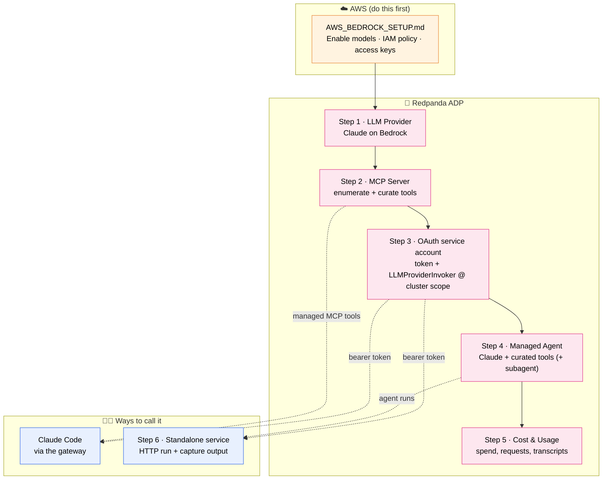

# Redpanda Agentic Data Plane (ADP) — Setup Guide

This guide walks you through standing up a working Agentic Data Plane from scratch, using **Claude on AWS Bedrock** as the model. By the end you'll have a governed AI Gateway, a managed agent that can call tools, and a couple of ways to talk to it (Claude Code and a plain HTTP call).

**What you'll build, in order:**

1. An **LLM provider** — Claude, served through AWS Bedrock.
2. An **MCP server** — the tools your agent can call.
3. An **OAuth service account** — so every request is authenticated and tracked.
4. A **managed agent** — Claude + your tools, hosted by Redpanda.
5. **Cost & usage** review — see what everything is spending.
6. A **standalone trigger** — kick off agent runs from your own code.

Everything routes through ADP, so your model keys stay server-side, spend shows up in one place, and conversations can be audited.

**Handy links:** [ADP Console](https://ai.redpanda.com) · [Quickstart](https://docs.redpanda.com/agentic-data-plane/get-started/adp-quickstart/) · [Claude Code + ADP](https://docs.redpanda.com/agentic-data-plane/connect/claude-code/)

**What's in this repo:**

| File | What it's for |
|---|---|
| `README.md` | This guide — the full end-to-end walkthrough. |
| [`AWS_BEDROCK_SETUP.md`](./AWS_BEDROCK_SETUP.md) | The AWS-side Bedrock setup you do first (IAM policy, user, keys). |
| [`adp-claude-code-service-account-auth.sh`](./adp-claude-code-service-account-auth.sh) | One-command automation for Step 3 — creates the service account, binds the role, mints a token, and launches Claude Code. |
| [`TROUBLESHOOTING.md`](./TROUBLESHOOTING.md) | Fixes for the `403`/`401`/`404` errors you might hit. |
| [`PRESENTATION_PROMPT.md`](./PRESENTATION_PROMPT.md) | A ready-to-use prompt for generating a slide deck of this whole workflow. |

---

## Workflow at a glance



The path: set up Bedrock on AWS → register it as a **provider** in ADP → expose **tools** via MCP → mint a governed **identity** (OAuth service account) → assemble a **managed agent** → watch **cost & usage**. From there, both **Claude Code** and **your own services** reach everything through the gateway, so every request is authenticated, curated, and recorded.

---

## Table of contents

- [Before you start](#before-you-start)
  - [⚠️ Do the AWS Bedrock setup first](#️-do-the-aws-bedrock-setup-first)
- [1. Set up an LLM Provider (Admin)](#1-set-up-an-llm-provider-admin)
- [2. Set up an MCP Server and curate its tools (Builder)](#2-set-up-an-mcp-server-and-curate-its-tools-builder)
- [3. Set up an OAuth service account for Claude Code / AI Gateway (governance)](#3-set-up-an-oauth-service-account-for-claude-code--ai-gateway-governance)
  - [3a. Grab your proxy URL, provider name, and cluster ID](#3a-grab-your-proxy-url-provider-name-and-cluster-id)
  - [3b. Get a Control Plane admin token (for setup only)](#3b-get-a-control-plane-admin-token-for-setup-only)
  - [3c. Create a service account](#3c-create-a-service-account)
  - [3d. Grant it permission to call the gateway](#3d-grant-it-permission-to-call-the-gateway)
  - [3e. Get a runtime access token](#3e-get-a-runtime-access-token)
  - [3f. Smoke-test the provider](#3f-smoke-test-the-provider)
  - [3g. Point Claude Code at the gateway](#3g-point-claude-code-at-the-gateway)
  - [3h. Attach a managed MCP server and confirm](#3h-attach-a-managed-mcp-server-and-confirm)
- [4. Build an Agent (Builder)](#4-build-an-agent-builder)
  - [Bonus: use a subagent to tame a noisy MCP server](#bonus-use-a-subagent-to-tame-a-noisy-mcp-server)
- [5. Review Cost & Usage](#5-review-cost--usage)
- [6. Trigger an agent run from your own service](#6-trigger-an-agent-run-from-your-own-service)
- [Troubleshooting](#troubleshooting)
- [Cleanup](#cleanup)

Companion docs: [AWS_BEDROCK_SETUP.md](./AWS_BEDROCK_SETUP.md) · [TROUBLESHOOTING.md](./TROUBLESHOOTING.md) · [PRESENTATION_PROMPT.md](./PRESENTATION_PROMPT.md)

---

## Before you start

You'll need:

- **ADP access** — the **Admin** role to set up the provider, or **Writer** to build agents.
- **An AWS account** with the AWS CLI configured. You'll set up Bedrock in a moment.
- **`curl`, `jq`, and Claude Code** installed locally. (The [Redpanda Cupboard](https://github.com/redpanda-data/cupboard) has these.)
- **Your ADP `<cluster-id>`** — you'll find it on any provider's **Connection** card.

### ⚠️ Do the AWS Bedrock setup first

Before anything else, work through **[AWS_BEDROCK_SETUP.md](./AWS_BEDROCK_SETUP.md)** — and follow it exactly.

It's short, but the details matter: the IAM policy needs the right permissions (including AWS Marketplace access for Bedrock's Marketplace engines), and current Claude models are only reachable through *inference profiles*, not plain model IDs. Skip or change a step and you'll hit `AccessDenied` or "invalid model" errors the moment you try to register the provider in Step 1.

When you're done, you'll have an AWS access key ID and secret access key. **Keep them handy** — you'll paste them into ADP in the next step.

---

## 1. Set up an LLM Provider (Admin)

This is where you connect ADP to Claude on Bedrock. You'll create a provider, hand it your AWS credentials, and pick which models it's allowed to serve.

> Finish the [AWS Bedrock setup](./AWS_BEDROCK_SETUP.md) first — this step uses the access keys you created there, and **Static keys** (below) is the matching credential type.

1. In ADP, go to **LLM Providers → Create provider**.
2. Give it a **Display name** of `bedrock-adp` and set **Provider type** to `AWS Bedrock`.
3. Set the **Region** to wherever your Bedrock models live — for example, `us-east-1`.
4. Choose a **Credential type**. Most people want the first one:
   - **Static keys** *(recommended for this guide)* — under each **secret reference → New**, create `AWS_ACCESS_KEY_ID` (the **Access key ID reference**) and `AWS_SECRET_ACCESS_KEY` (the **Secret access key reference**), paste the values from the Bedrock setup, and **Create secret**.
   - **Assume IAM role** — give ADP a **Role ARN** to assume via AWS STS. No long-lived keys to manage.
   - **Default chain** — lets the gateway use the AWS SDK's default credential chain (env vars, shared config, EKS Pod Identity, IRSA, instance profile). Use this only if the gateway already runs with an AWS identity.
5. Pick your models. **Current Claude models (4.6+) must be selected by their Bedrock *inference profile ID*** — a plain model ID won't work:
   - `global.anthropic.claude-opus-4-7` — works in any region, no cross-region premium. A good default.
   - `us.anthropic.claude-sonnet-4-6` / `eu.anthropic.claude-sonnet-4-6` — cheaper and faster, tied to a region.
   - `us.anthropic.claude-haiku-4-5` / `eu.anthropic.claude-haiku-4-5` — fastest and cheapest.

   *(Older 4.5-and-earlier models still accept plain IDs like `anthropic.claude-sonnet-4-5`.)* Then click **Create provider**.
6. Check that the provider badge shows **Enabled / Active**. You're connected.

> **If a model errors out:** Bedrock model IDs aren't the same as the first-party Claude API IDs — always use the `<geo>.anthropic.<model>` inference-profile form. An "invalid model" or "access denied" error almost always means the model isn't enabled under **Model access** in the Bedrock console for that region, or your IAM policy doesn't cover it.

---

## 2. Set up an MCP Server and curate its tools (Builder)

An MCP server is where your agent's tools come from. We'll use the public Swagger Petstore as a stand-in for a real API.

1. Go to **MCP Servers → Create server** and pick a connector from the marketplace — `OpenAPI` for this example.
   
2. Name it `petstore`, set the **Spec** to `https://petstore3.swagger.io/api/v3/openapi.json`, leave **Auth** as `None`, and **Create**.
3. Open the **Inspector** tab to see every tool the server exposes — you'll spot things like `findpetsbystatus`, `getpetbyid`, `addpet`, and `deletepet`.
4. **Trim the tool list down to what the agent actually needs.** A chatty server dumps dozens of tools into the model's context — that wastes tokens and invites the agent to do things you didn't intend. Disable everything you don't need (keep the read tools, drop the writes and deletes). A short, deliberate list means a smaller context window and a safer agent.
5. Copy the server's **API URL** from its detail page — you'll want it later.

---

## 3. Set up an OAuth service account for Claude Code / AI Gateway (governance)

So far the provider works, but nothing outside ADP can reach it yet. This step creates a service account, gives it exactly one permission (invoke the gateway, nothing more), and gets you a token you can use from Claude Code or your own scripts.

This is the part that trips people up most, so it's broken into small, verifiable steps.

> **Two things are happening here, and it helps to keep them separate:**
> - **Authentication** — the service account's **Client ID** + **Client Secret** mint a short-lived bearer token that proves *who* you are.
> - **Authorization** — a Redpanda *role binding* decides *what* that identity is allowed to do. The token's JWT may only show broad scopes like `organization-info`; the actual gateway permission (`dataplane_adp_llmprovider_invoke`) is checked server-side from role bindings, so don't expect to see it in the token itself.

> 🚀 **Fast path — let the script do it.** [`adp-claude-code-service-account-auth.sh`](./adp-claude-code-service-account-auth.sh) automates this entire step: it can create the service account, add the cluster-scope role binding, mint a token, run the smoke test, write Claude Code's settings, and launch Claude Code. First-time run:
>
> ```bash
> export ADMIN_TOKEN='<control-plane-token>'   # see 3b for how to get this
> export PROXY_URL='https://aigw.<cluster-id>.clusters.rdpa.co/llm/v1/providers/bedrock-adp'
> ./adp-claude-code-service-account-auth.sh \
>   --create-service-account --ensure-rbac --smoke-test -- 'say hello'
> ```
>
> It saves credentials to a git-ignored `.adp-claude-code.env`, so later runs are just `./adp-claude-code-service-account-auth.sh -- 'say hello'`. Run `--help` for all options. The manual steps below explain exactly what the script does — walk through them once so you understand the moving parts.

### 3a. Grab your proxy URL, provider name, and cluster ID

Open **LLM Providers**, click your Bedrock provider, and copy the **Proxy URL** from its **Connection** card. It looks like this:

```text
https://aigw.<cluster-id>.clusters.rdpa.co/llm/v1/providers/<provider-name>
```

Save the pieces you'll reuse throughout this step:

```bash
export ADP_CLUSTER_ID='<cluster-id>'          # the part in aigw.<cluster-id>.clusters.rdpa.co
export ADP_PROVIDER_NAME='bedrock-adp'        # the path segment after /providers/
export PROXY_URL="https://aigw.${ADP_CLUSTER_ID}.clusters.rdpa.co/llm/v1/providers/${ADP_PROVIDER_NAME}"
```

The provider name is just the last path segment (`bedrock-adp` here). One thing to watch: when you set up the role binding below, use the bare cluster ID — **not** the full proxy URL.

### 3b. Get a Control Plane admin token (for setup only)

Creating a service account and its role binding are admin operations against `https://api.redpanda.com`, so they need a **Control Plane token** with organization/IAM permissions. This is *only* used for setup — it's a different token from the runtime one Claude Code uses (that comes in 3e).

The repeatable way is to mint one from an existing bootstrap service account that has org-admin rights:

```bash
export ADMIN_CLIENT_ID='<bootstrap-admin-service-account-client-id>'
read -rsp 'ADMIN_CLIENT_SECRET: ' ADMIN_CLIENT_SECRET; export ADMIN_CLIENT_SECRET; echo

export ADMIN_TOKEN="$(curl -fsS --request POST \
  --url 'https://auth.prd.cloud.redpanda.com/oauth/token' \
  --header 'content-type: application/x-www-form-urlencoded' \
  --data grant_type=client_credentials \
  --data client_id="${ADMIN_CLIENT_ID}" \
  --data client_secret="${ADMIN_CLIENT_SECRET}" \
  --data audience=cloudv2-production.redpanda.cloud | jq -r .access_token)"

test -n "${ADMIN_TOKEN}" && test "${ADMIN_TOKEN}" != 'null'
```

Before you create anything with it, confirm the token belongs to the **right organization** — the one where your provider lives:

```bash
curl -fsS 'https://api.redpanda.com/v1/organizations/current' \
  -H "Authorization: Bearer ${ADMIN_TOKEN}" \
  | jq '.organization | {id, name}'
```

If that's the wrong org, stop and mint the token from a service account in the correct one. You can also grab a token interactively from the Cloud API Explorer ("Get token" on any endpoint), but for terminal work the flow above is cleaner.

> **Keep it out of the repo.** Don't commit `ADMIN_CLIENT_SECRET` or `ADMIN_TOKEN`, don't reuse your runtime Claude Code service account as the admin credential, and rotate anything that lands in chat, logs, or a ticket.

### 3c. Create a service account

**In the Redpanda Cloud UI:**

1. Go to **Organization IAM → Service account** and create a new one — call it `llm-invoker`.
2. Copy the **Service Account ID**, **Client ID**, and **Client Secret** right away. The secret is shown **only once**, so save it to a secret manager before you close the dialog.

**Or, from the Control Plane API:**

```bash
curl -fsS --request POST \
  --url 'https://api.redpanda.com/v1/service-accounts' \
  --header 'content-type: application/json' \
  --header "authorization: Bearer ${ADMIN_TOKEN}" \
  --data '{
    "service_account": {
      "name": "llm-invoker",
      "description": "Service account for proxying LLM requests through AI Gateway"
    }
  }' | jq .
```

Either way, save all three values — you'll need each of them below:

```bash
export SERVICE_ACCOUNT_ID='<service-account-id>'  # role bindings use THIS, not the Client ID
export CLIENT_ID='<oauth-client-id>'
export CLIENT_SECRET='<oauth-client-secret>'
```

> ⚠️ The **Service Account ID** and the **Client ID** are different values that look alike. Role bindings use the *Service Account ID*. Mixing these up is the #1 cause of the `403` errors in [TROUBLESHOOTING.md](./TROUBLESHOOTING.md).

### 3d. Grant it permission to call the gateway

The only permission the service account needs is `dataplane_adp_llmprovider_invoke`. That comes bundled in the built-in **`LLMProviderInvoker`** role — the narrowest role for something that just proxies LLM requests.

For this guide, bind `LLMProviderInvoker` at the **Cluster** scope, using the cluster ID from your proxy URL:

```text
Role:      LLMProviderInvoker
Scope:     Cluster
Resource:  <cluster-id>
```

> **Why cluster scope?** The `AI Gateway Model Provider` scope looks like the tighter, more "correct" choice — but in testing, a provider-scoped binding is accepted and then the gateway still returns `403 lacks permission dataplane_adp_llmprovider_invoke on provider "<provider-name>"`. A temporary `Writer` binding at provider scope failed too. Cluster scope is the combination that actually works. *(If provider-scope least-privilege is important to you, flag it — it's arguably an authorization gap worth confirming with the ADP team.)*

Create the binding through the Control Plane API (reusing `ADMIN_TOKEN` from 3b):

```bash
export ROLE_BINDING_ID="$(curl -fsS -X POST 'https://api.redpanda.com/v1/role-bindings' \
  -H "Authorization: Bearer ${ADMIN_TOKEN}" \
  -H 'Content-Type: application/json' \
  --data "$(jq -n \
    --arg account_id "${SERVICE_ACCOUNT_ID}" \
    --arg cluster_id "${ADP_CLUSTER_ID}" \
    '{role_binding:{account_id:$account_id,role_name:"LLMProviderInvoker",scope:{resource_type:"SCOPE_RESOURCE_TYPE_CLUSTER",resource_id:$cluster_id}}}')" \
  | jq -r '.role_binding.id')"

echo "Created role binding: ${ROLE_BINDING_ID}"
```

> On a **serverless** cluster, swap `SCOPE_RESOURCE_TYPE_CLUSTER` for `SCOPE_RESOURCE_TYPE_SERVERLESS_CLUSTER`.

### 3e. Get a runtime access token

Trade the service account's client ID and secret for a short-lived access token. This is the token Claude Code (or your own code) sends to the gateway — **not** the setup-only `ADMIN_TOKEN` from 3b.

```bash
export AUTH_TOKEN="$(curl -fsS --request POST \
  --url 'https://auth.prd.cloud.redpanda.com/oauth/token' \
  --header 'content-type: application/x-www-form-urlencoded' \
  --data grant_type=client_credentials \
  --data client_id="${CLIENT_ID}" \
  --data client_secret="${CLIENT_SECRET}" \
  --data audience=cloudv2-production.redpanda.cloud | jq -r .access_token)"

# quick sanity check — should print nothing and exit 0
test -n "${AUTH_TOKEN}" && test "${AUTH_TOKEN}" != 'null'
```

These tokens don't live long. Re-run this before a long Claude Code session, or wrap it in a shell function so it's always fresh. (And don't echo the token around — treat it like a password.)

### 3f. Smoke-test the provider

Before wiring up Claude Code, confirm the token and permissions actually work by calling Bedrock through the gateway directly:

```bash
export BEDROCK_MODEL_ID='us.anthropic.claude-sonnet-4-6'

curl -i -X POST "${PROXY_URL}/model/${BEDROCK_MODEL_ID}/invoke" \
  -H "Authorization: Bearer ${AUTH_TOKEN}" \
  -H 'Content-Type: application/json' \
  -d '{
    "anthropic_version": "bedrock-2023-05-31",
    "messages": [{"role": "user", "content": "hello"}],
    "max_tokens": 64
  }'
```

You want to see `HTTP/2 200` and a normal Claude-style reply. If you instead get a `403 lacks permission dataplane_adp_llmprovider_invoke`, it's almost always one of these — see [TROUBLESHOOTING.md](./TROUBLESHOOTING.md) for the full checklist:

- You used the **Client ID** instead of the **Service Account ID** in the role binding.
- The binding isn't at **cluster scope**, or its `resource_id` doesn't match your `<cluster-id>`.
- You're using a token minted *before* the role binding existed — grab a fresh one (3e).
- The request is hitting a different cluster than the one in the role binding.

### 3g. Point Claude Code at the gateway

Claude Code speaks the Anthropic API, and it reads its config from environment variables. Point it at your proxy URL and hand it the token:

```bash
export ANTHROPIC_AUTH_TOKEN="${AUTH_TOKEN}"
export ANTHROPIC_BASE_URL="${PROXY_URL}"

claude "say hello"
```

> **Tip:** the provider's **Connect** tab can generate this snippet for you — pick **Claude Code** from the client dropdown and copy what it gives you. Just make sure the base URL matches your provider URL exactly.

If the smoke test in 3f passed but Claude Code doesn't work, the mismatch is usually the provider type or the base URL. Claude Code talks the Anthropic API, whereas a raw Bedrock provider uses Bedrock-style paths like `/model/<model-id>/invoke` (which is exactly what 3f exercised). If in doubt, check the **Connect** tab for the supported Claude Code configuration.

### 3h. Attach a managed MCP server and confirm

1. Connect the MCP server from Step 2 to Claude Code. OAuth-protected servers pop a one-time consent flow, and tokens get cached in ADP's per-user vault.

   ```bash
   claude mcp add petstore "https://aigw.${ADP_CLUSTER_ID}.clusters.rdpa.co/mcp/v1/petstore"
   ```

2. Run `claude "say hello"` — the request should show up in **Cost & Usage** within seconds. That's your confirmation the whole path is wired up.

---

## 4. Build an Agent (Builder)

Now the fun part: a hosted agent that combines Claude with the tools you curated.

1. Go to **Agents → Create agent → Redpanda manages it**.
2. Under **Details**, name it `pet-store-assistant` and add a short description.
3. For the **Model**, pick provider `bedrock-adp` and model `us.anthropic.claude-sonnet-4-6`.
4. Set the **system prompt** under **Behavior**:

   ```
   You are a pet store inventory assistant with access to PetStore MCP tools.
   - Always call a tool before answering.
   - After each call, summarize and cite the tool name.
   - Read operations only; if a tool fails, say so and stop.
   ```

5. Under **Tools**, attach the `petstore` MCP server — the trimmed-down list from Step 2.
6. **Create agent** and wait for it to go **Starting → Running**. Then test it in the **Inspector** tab — try *"What pets are available right now?"* Use **Clear context** between tests so old messages don't leak in.

### Bonus: use a subagent to tame a noisy MCP server

If a server exposes a firehose of tools, give a **subagent** the full list and have it do the digging. The parent agent gets a curated set plus the subagent, delegates a focused question, and receives a tidy answer back — so all that raw tool sprawl never clutters the parent's context.

---

## 5. Review Cost & Usage

Once traffic is flowing, ADP shows you where the money and requests are going:

- **Home dashboard** — request and spend activity at a glance, plus budget status.
- **Cost & Usage / Governance** — filter the **Requests over time** chart by provider to see spend per agent or client.
- **Transcripts** *(if logging is on)* — the full conversation history per provider, for auditing.

---

## 6. Trigger an agent run from your own service

You don't have to use Claude Code — any service can call the agent over HTTP. It reuses the same OAuth flow from Step 3.

```bash
#!/usr/bin/env bash
# run-agent.sh — trigger an ADP agent from a standalone service
set -euo pipefail

TOKEN=$(curl -s --request POST \
  --url 'https://auth.prd.cloud.redpanda.com/oauth/token' \
  --header 'content-type: application/x-www-form-urlencoded' \
  --data grant_type=client_credentials \
  --data client_id="$ADP_CLIENT_ID" \
  --data client_secret="$ADP_CLIENT_SECRET" \
  --data audience=cloudv2-production.redpanda.cloud | jq -r .access_token)

curl -s --request POST \
  --url "https://aigw.${CLUSTER_ID}.clusters.rdpa.co/agents/v1/pet-store-assistant/runs" \
  --header "authorization: Bearer ${TOKEN}" \
  --header 'content-type: application/json' \
  --data '{"input": "What pets are available right now?"}' \
| tee agent-output.json | jq -r '.output'
```

A few notes:

- Set `ADP_CLIENT_ID`, `ADP_CLIENT_SECRET`, and `CLUSTER_ID` as environment variables in your service.
- The reply is saved to `agent-output.json`, and the run also shows up in Cost & Usage / Transcripts.
- Double-check the exact agent run path against the agent's **Connection** card in the console — endpoints can vary by ADP version.

---

## Troubleshooting

Seeing `403 lacks permission dataplane_adp_llmprovider_invoke` or another gateway auth error? **[TROUBLESHOOTING.md](./TROUBLESHOOTING.md)** has the full role-binding checklist — wrong identity, wrong scope, stale tokens, propagation delays — plus how to tell `401`, `403`, and `404` apart.

---

## Cleanup

When you're done, tear things down in this order: **Agent → MCP server → LLM provider**. Then, optionally, remove the credential secrets — or, if you used an assumed IAM role, revoke or rotate it in AWS.
